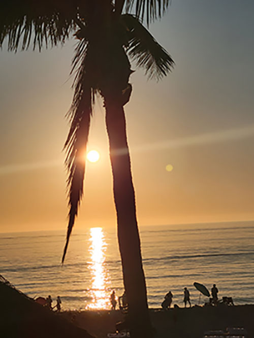

## My First Coding Assignment 




## About Me 

I love my family, nature, and being active.  I have run 10 triathlons.  I am married and have 3 awesome children!  I enjoy traveling to experience the many beautiful and exciting places in the world.  I also enjoy listening to music and going to concerts. 


## Past Coding Experience 

?? I have taken a beginner class using visual studio code but have not used "GIT or GITHub at all.  These tools are cofusing to me because everything I have done in the past has always been saved in a folder on my desktop.

## Career Goals

My Career Goals are:
```
1. Complete this course and obtain a remote internship next summer.
2. Complet the UF Masters Degree in Web Design and find a full time position in web desing.
3. Find a remote job position that I can enjoy and work anywhere; even when I travel.
```
